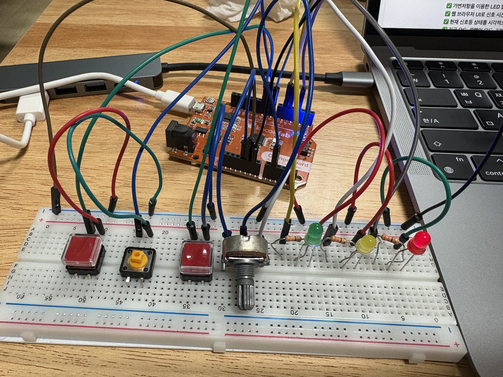
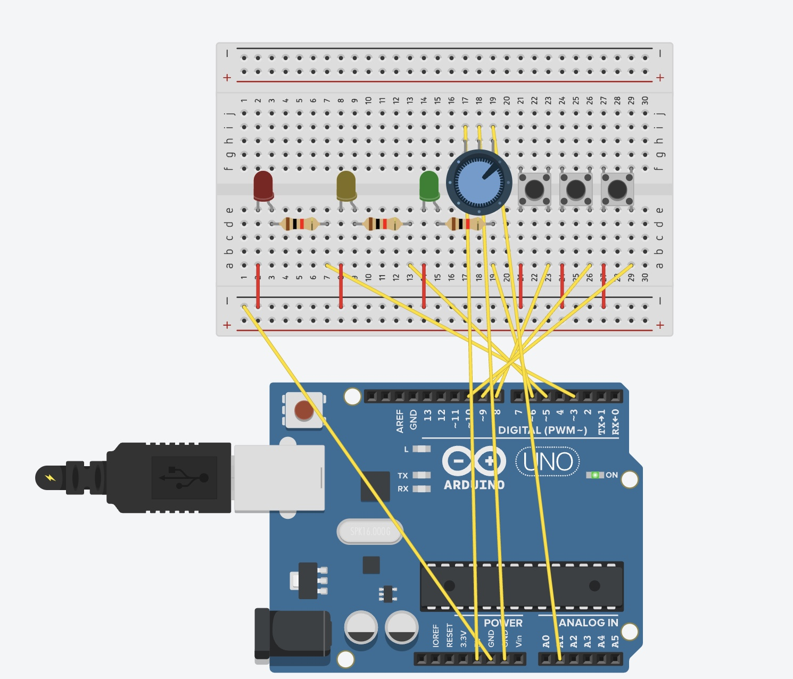

# 🚦 Arduino Traffic Light Control System

> **p5.js 기반 웹 인터페이스와 아두이노를 이용한 신호등 제어 시스템**  
> 실시간으로 신호등의 상태를 조절하고, 웹 인터페이스에서 조작 가능!

---

## 📌 프로젝트 개요
이 프로젝트는 **아두이노(Arduino)**와 **p5.js(Web Serial API)**를 사용하여 웹 브라우저에서 신호등을 제어하는 시스템입니다.

## 🎯 주요 기능
✅ **가변저항을 이용한 LED 밝기 조절**  
✅ **웹 브라우저 UI로 신호 시간 설정 (슬라이더)**  
✅ **현재 신호등 상태를 시각적으로 표시**  
✅ **긴급 모드, 깜빡임 모드, 기본 동작, 신호등 OFF 지원**  
✅ **웹 인터페이스와 아두이노가 실시간으로 동작**

---

## 🔥 동작 영상 (Demo)
[

📢 **설명:**  
위의 영상을 클릭하면 신호등의 작동 원리를 확인할 수 있습니다.

---

## 🛠️ 사용 부품
| 부품명 | 설명 |
|--------|--------|
| **아두이노** | Arduino Uno |
| **LED** | 빨강(R), 노랑(Y), 초록(G) |
| **가변저항** | 밝기 조절용 |
| **버튼** | 모드 변경용 |

### **🔧 회로 구성도**
아래와 같은 회로를 구성합니다.

---
###  **웹 UI 기능**
- **슬라이더**: 신호등 시간 조절
- **연결 버튼**: 웹 시리얼로 아두이노 연결
- **모드 인디케이터**: 현재 동작 상태 확인

---
### **아두이노 코드 요약**
- TaskScheduler를 사용해 순차적으로 Task 실행
- PCINT를 사용해 빠르게 인터럽트 실행 가능
- 시리얼 데이터 수신, 송신 가능

---
### **P5 코드 요약**
- 웹 시리얼을 사용해 아두이노와 연결
- 신호 길이 변경 슬라이더, 신호등 그래픽, 모드 및 밝기 인디케이터를 사용
- 실시간으로 상태 변화 확인 가능

